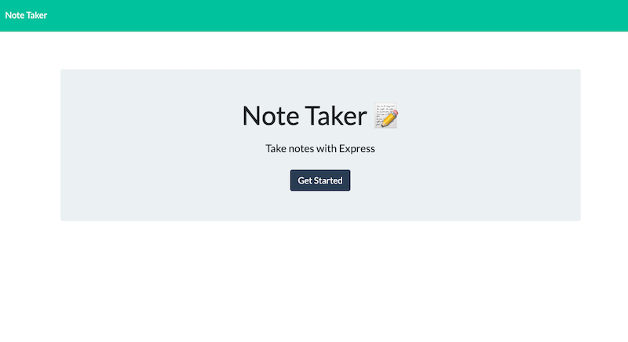
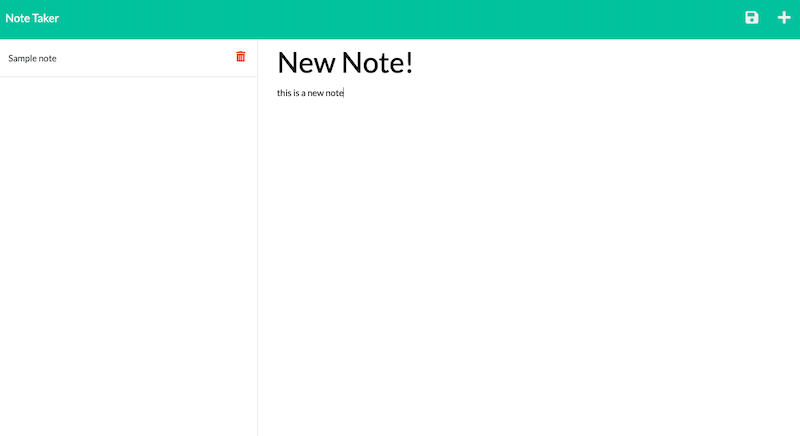
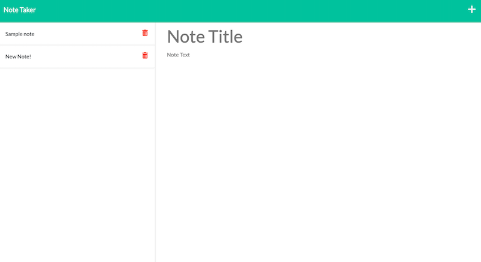

# Note Taker

## Description
Note Taker is an application that can be used to write and save notes. It uses an Express.js back end that saves and retrieves notes from a JSON file. 

---

## Usage

When the user first visits the Note Taker application, they will be presented with a button that says "get started." When this button is clicked it will take the user to a page containing all of their saved notes (if they exist). From there, the user has an option to view the saved notes by clicking on them, create a new note, or delete an existing note by clicking on the trash can icon.

A link to the live Note Taker app can be found here: https://warm-harbor-89568.herokuapp.com/







---

## Questions

Starter code was provided, server.js file was written by me. For questions about my contributions to this app, please contact me at hopemansfield@gmail.com.


```
